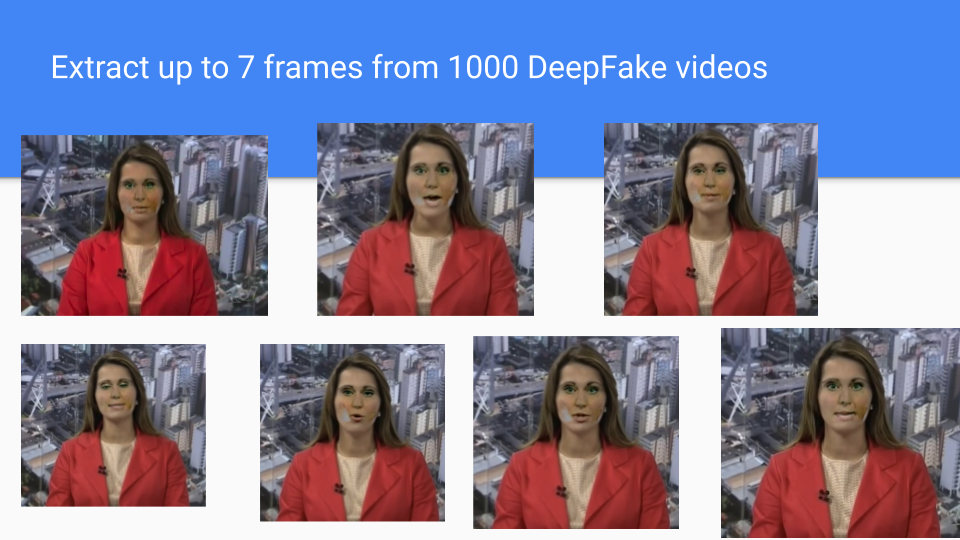
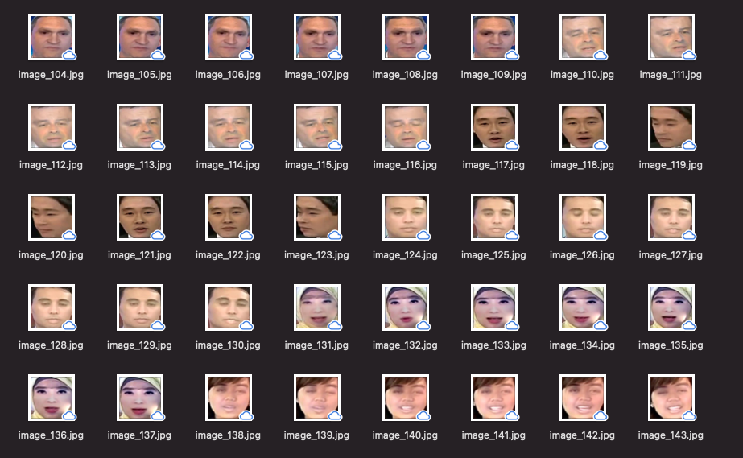
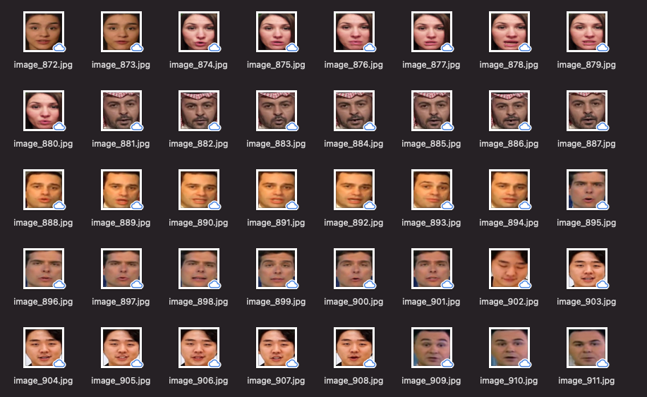
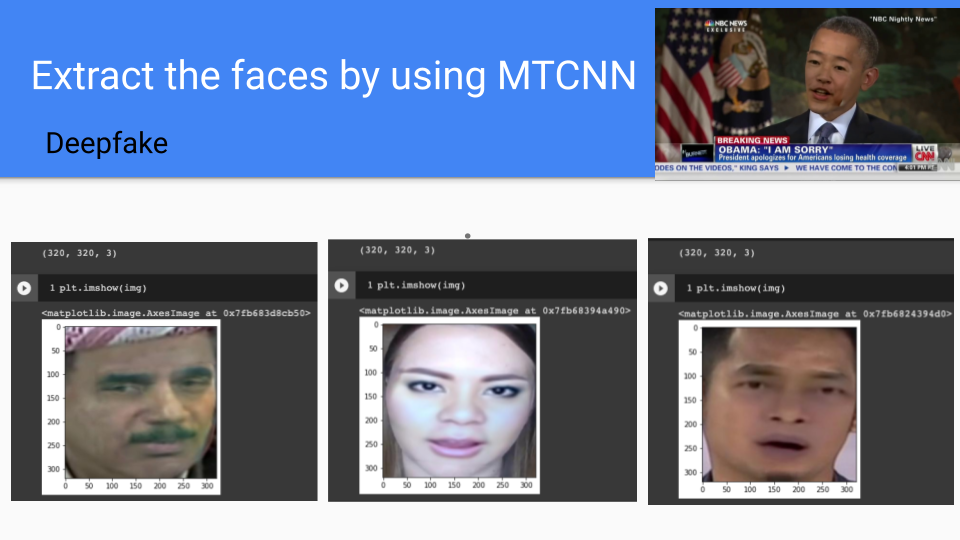
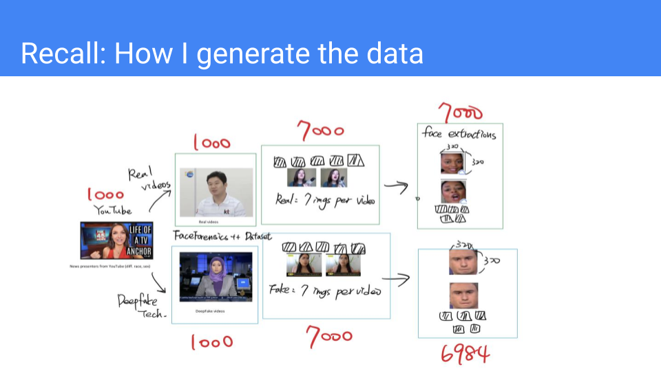
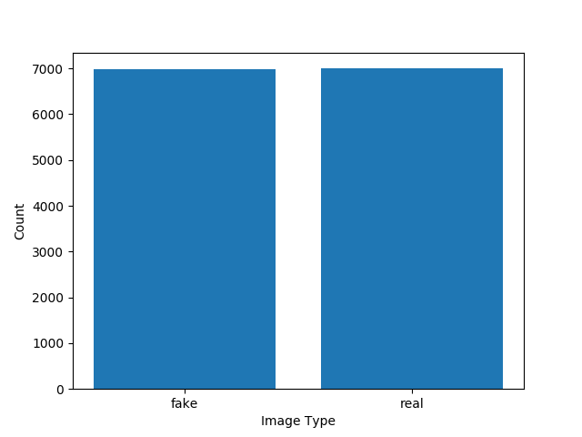
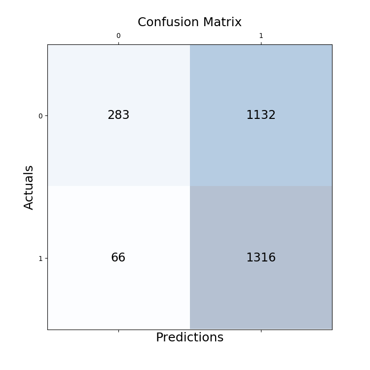
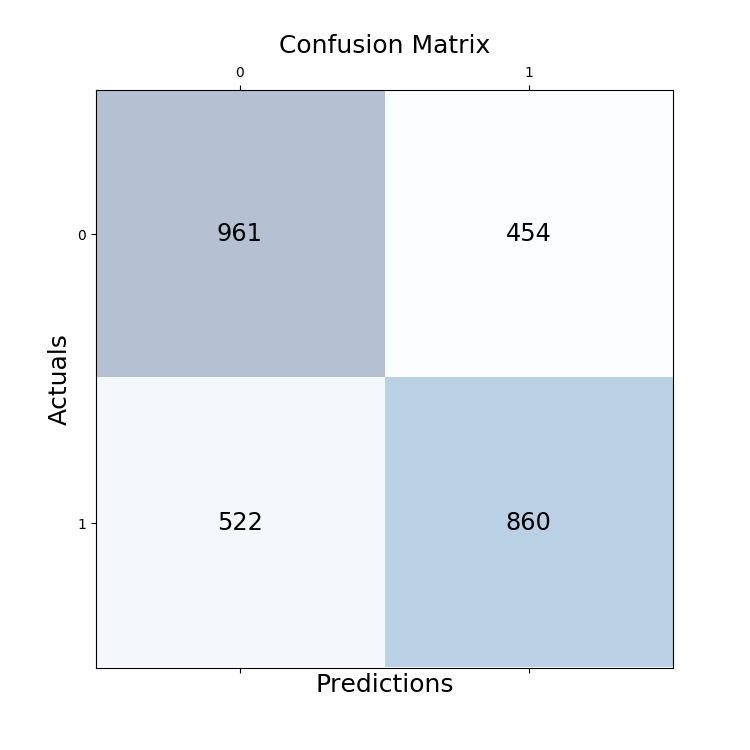
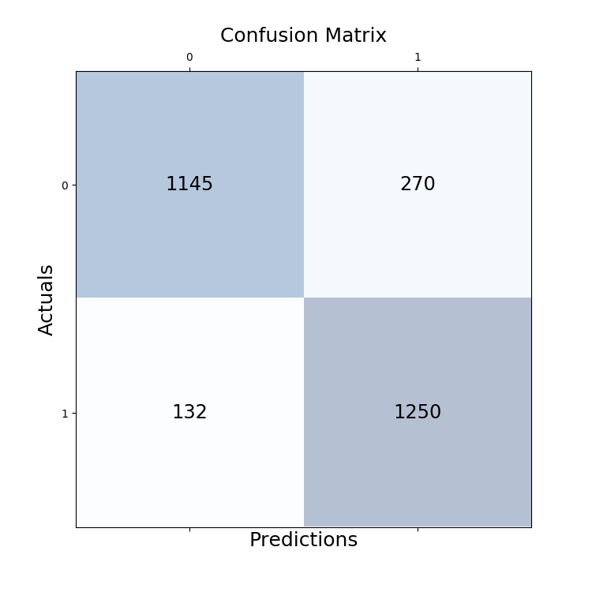
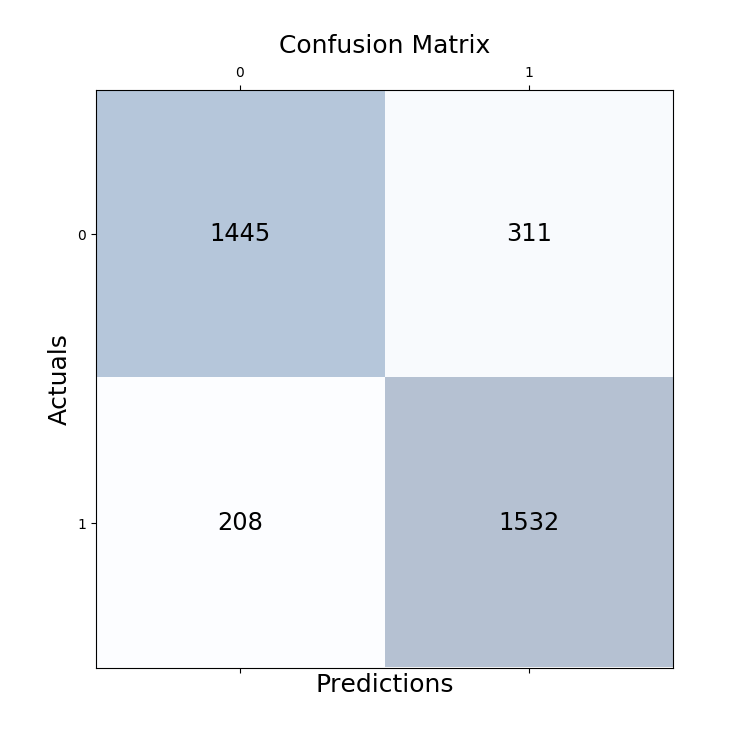

# High Performance DeepFake Video Classifier

# Abstract

  Videos may fool people nowadays and they are causing trouble. This is due to a technology called DeepFake. Deepfake is a technique that makes computer-created artificial videos in which images are combined to create new footage. Recently, Deefake technique has been widely discussed in Taiwan since a famous Taiwanese YouTuber was discovered to be responsible for producing, selling, and circulating Deepfake videos of women, mostly public figures. Based on this, techniques for solving this kind of problem have been in high demand because more and more relevant issues about misuse of Deepfake technique will be extensively expanded in the future. I have relevant experience in building a machine learning model to determine whether the input video is fake or real. Moreover, I am working on a computer vision project that analyzes deepfake videos as part of my Advanced Machine Learning class project. As a result, I feel the need to apply my pertinent academic background to this project so that this model can solve some problems in reality. **The main goal of the project is to assist people in determining whether a given video was generated using the Deepfake technique or a real video by using the DeepFake Video Classifier Model that I created.**

# Dataset

  [FaceForensics++](https://arxiv.org/abs/1901.08971)[1] is a popular and widely used database for detecting image or video forgeries. FaceForensics++ is a forensics dataset consisting of 1000 original YouTube videos that have been manipulated with four automated face manipulation methods: Deepfakes, Face2Face, FaceSwap and NeuralTextures. In this project, I experiment on `Deepfakes` subset for fake videos, and I also download original videos from the same source that the authors use to create fake videos for real videos. Both can be found from [FaceForensics GitHub](https://github.com/ondyari/FaceForensics). The videos have a wide range of facial expressions because they are about TV reporters and journalists of various sexes, ages, and races.

In short, the Deepfake classification model is generated by 2000 videos, which includes 1000 real videos and 1000 fake videos utilizing Deepfake technology. 

# Methodology
## Download the Dataset

I use the Python script provided by the authors to download the whole data set from FaceForensics++. The entire data is larger than 2 terabytes. Please see [`00.FaceForensics_download_script.ipynb`](https://github.com/twyunting/Deepfake_Video_Classifier/blob/main/code/00.FaceForensics_download_script.ipynb) for the source code. 

## Extract Video Frames and Save to Images

  According to the relevant academic work, Abdali et al.[2] did the similar Deepfake classification model using FaceForensics++. Since all videos have constant frame rate 30 fps, they extract up to 7 frames from each video and save them as images, so I use the same method based on the author's idea. To be more specific, I extract 1 frame in every 30 frames totally extract 7 images in one video. In this case, I can capture different facial expressions in a single video. Now I have 1000 Deepfake videos and 1000 original videos. After executing the code, I have 14000 images (observations), which includes 7000 "fake" images and 7000 "real" images. I mainly use `cv2` and `imageio` to capture features form the given videos. Please see [`01.capture_videos_to_images.ipynb`](https://github.com/twyunting/Deepfake_Video_Classifier/blob/main/code/01.capture_videos_to_images.ipynb) for the source code. 

### Seven Different Facial Expressions from a Fake Video

### Seven Different Facial Expressions from a Real Video

## Facial Extraction using MTCNN

MTCNN (Multi-Task Cascaded Convolutional Neural Networks)[3] is a type of neural network that recognizes faces and facial landmarks in images. It was published by Zhang et al. in 2016. MTCNN is a good face detector that provides exactly pixel positions of precise nose, mouth, left eye, right eye, and face boundary. Thanks for the prior research, I can now simply install a `MTCNN` package to capture the facial features. 

If we read one image, the MTCNN model returns three index: `box`, `confidence` and `keypoints`.

- The bounding `box` is formatted as `[x, y, width, height]` under the key `box`.
- The `confidence` is the probability for a bounding box to be matching a face.
- The `keypoints` are formatted into a JSON object with the keys `left_eye`, `right_eye`, `nose`, `mouth_left`, `mouth_right`. Each `keypoint` is identified by a pixel position $(x, y)$.

However, how do we deal with images in which the face shape is unclear? Based on this, I add one more condition to set `if confidence > 0.9` in the facial extraction function, which means that if MTCNN does not have 90 % confidence to identify an input image that includes a face, I will remove it because it is a "outlier". Finally, I capture 6984 out of 7000 facial images in the fake set, and capture 7000 out of 7000 facial images in the real set. The capture rate of Deepfake images is 99.77%, and the capture rate of original images is 100%. I also unify the image size to 320 x 320 x 3 using `PIL` package. In conclusion, now I have 13984 observations, which include 6984 fake images and 7000 real images. Please see [`02.facial_extractions.ipynb`](https://github.com/twyunting/Deepfake_Video_Classifier/blob/main/code/02.facial_extractions.ipynb) for the source code. 

### Fake Image Examples

### Real Image Examples

### Data Generating Process

## Construct X Features and y Labels

My task for this session is to save each image as a one-dimensional array. The images are three-dimensional in nature. I need to change the dimensions from 320 x 320 x 3 to 307200 x 1. `numpy.ndarray.flatten` is an excellent way to deal with it. This is supervised learning, so I have 13984 one-dimensional arrays that I label "fake" or "real" for each array in order to tell models the ground truth for each observation.

What does the data looks like? In short, the data has 307201 variables (307200$X$ features + 1$y$ label), and the number of observations is 13984, with 6984 fake arrays and 7000 real arrays. Please see [`03.construct_Xfeatures_ylabels.ipynb`](https://github.com/twyunting/Deepfake_Video_Classifier/blob/main/code/03.construct_Xfeatures_ylabels.ipynb) for the source code.

## Debugging Checks

I try to reduce the number of observations to run on my local computer in order to save computation time and memory usage. The two code sessions that follow are for debugging: [04.machine_learning_tasks_1998_rows_only.ipynb](https://github.com/twyunting/Deepfake_Video_Classifier/blob/main/code/04.machine_learning_tasks_1998_rows_only.ipynb) and [05.HPC_machine_learning_tasks.py](https://github.com/twyunting/Deepfake_Video_Classifier/blob/main/code/05.HPC_machine_learning_tasks.py).

## High Performance Computing

High performance computing (HPC) is the ability to process data and perform complex calculations at high speeds. Because I am working with large data sets, my computer is unable to execute machine tasks. The all following `.py` files are running on HPC.

## Model Selection
There are many machine models that excel at classification tasks, such as LDA, QDA, and logistic regression. However, the number of data features is much larger, exceeding 300,000. It is hard to visualize the relationship between each feature, not to mention assume the data points are following linear or quadric relationship so LDA and QDA are not wise choices. Furthermore, logistic regression is overly sensitive to training set proportions, so if you slightly change the proportion of training set, the outcome will be completely different.

KNN and SVM are also good models to construct a classifier. The downside is that the data now has a lot of features. Although I can scale and normalize data points before running the models, two model algorithms still require a lot of computation time to deal with a large number of features. 

How about dimensionally reduce the number of features? Ridge and Lasso regression can penalize coefficient values in order to reduce data dimension. In image processing, each pixel value (data point) has its means, such as 0 represents black, 255 represents white, and 128 most likely represents gray. It is not a wise choice if I shrink coefficients to zero.

I believe **random forest model** is a suitable model for the data. Firstly, it can handle large features efficiently. The random forest algorithm outperforms the decision tree algorithm in terms of accuracy in predicting outcomes. Secondly, it is not necessary to normalize data points before I run the model. Thirdly, when compared to SVM and logistic regression, it can drastically reduce computation time. I will demonstrate this in the experimental results session.

# Computing Environment
## Required Programming Language
- At least Python 3.6.9

## Coumputer Specification and Google Colab
I use Google Colab free version to run all Python notebook files. My computer is MacBook Pro (13-inch, 2020, Four Thunderbolt 3 ports), the processor is 2 GHz Quad-Core Intel Core i5 with 16 GB memory 3,733 MHz LPDDR4X.

## High Performance Computing
I use HPC to run all Python script files through [`@zorro.american.edu`](https://www.american.edu/cas/hpc/) with my American University personal account.

# Experimental Results
## Data Visualization

There are 13984 observations, which include 6984 fake rows and 7000 real rows.

## SVM (80% Training & 20 % Testing, C = 1)
- Accuracy Score: 0.85305684662138
- Source code: [`06.svm_80_20.py`](https://github.com/twyunting/Deepfake_Video_Classifier/blob/main/code/06.svm_80_20.py)

The accuracy score is 85.31%, which is great. Running the code, on the other hand, takes more than 12 hours.

### HPC Usage Summary

    CPU time :                                   43616.16 sec.
    Max Memory :                                 63202 MB
    Average Memory :                             30266.94 MB
    Total Requested Memory :                     -
    Delta Memory :                               -
    Max Swap :                                   -
    Max Processes :                              5
    Max Threads :                                29
    Run time :                                   43579 sec.
    Turnaround time :                            43581 sec.

### Confusion Matrix
- 0 represents fake, and 1 represents real

### Classification Report

                  precision    recall  f1-score   support

            fake       0.89      0.81      0.85      1415
            real       0.82      0.90      0.86      1382
    
        accuracy                           0.85      2797
       macro avg       0.86      0.85      0.85      2797
    weighted avg       0.86      0.85      0.85      2797
    
## SVM (80% Training & 20 % Testing, C = 0.01)
- Accuracy Score: 0.5716839470861638
- Source code: [`06.svm_80_20.py`](https://github.com/twyunting/Deepfake_Video_Classifier/blob/main/code/06.svm_80_20.py)

In Python's sklearn module, the regularization parameter (also known as the $C$ parameter) tells the SVM optimization how much you want to prevent misclassifying each training example. A small value of $C$ will cause the optimizer to look for a larger-margin separating hyperplane, even if that hyperplane misclassifies more points. After lowing $C$ value to 0.01, the accuracy score drops to 57.17%. Especially, the precision score drops to 54%, meaning that the model basically is unable to classify the real videos.

### HPC Usage Summary

    CPU time :                                   58828.59 sec.
    Max Memory :                                 62074 MB
    Average Memory :                             31843.03 MB
    Total Requested Memory :                     -
    Delta Memory :                               -
    Max Swap :                                   -
    Max Processes :                              5
    Max Threads :                                29
    Run time :                                   58768 sec.
    Turnaround time :                            58769 sec.

### Confusion Matrix
- 0 represents fake, and 1 represents real

### Classification Report

                  precision    recall  f1-score   support

            fake       0.81      0.20      0.32      1415
            real       0.54      0.95      0.69      1382
    
        accuracy                           0.57      2797
       macro avg       0.67      0.58      0.50      2797
    weighted avg       0.68      0.57      0.50      2797

## Logistic Regression (80% Training & 20 % Testing)    
- Accuracy Score: 0.6510547014658563
- Source code: [`09.logr_80_20.py`](https://github.com/twyunting/Deepfake_Video_Classifier/blob/main/code/09.logr_80_20.py)

The computation time is terrible if logistic regression deal with a larger number of features. Moreover, the accuracy does not performs well, meaning that logistic regression is not a good classifier for the task.

### HPC Usage Summary

    CPU time :                                   95302.73 sec.
    Max Memory :                                 82687 MB
    Average Memory :                             82564.51 MB
    Total Requested Memory :                     -
    Delta Memory :                               -
    Max Swap :                                   -
    Max Processes :                              5
    Max Threads :                                29
    Run time :                                   82117 sec.
    Turnaround time :                            82122 sec.
    
### Confusion Matrix
- 0 represents fake, and 1 represents real

### Classification Report

                  precision    recall  f1-score   support

            fake       0.65      0.68      0.66      1415
            real       0.65      0.62      0.64      1382

        accuracy                           0.65      2797
       macro avg       0.65      0.65      0.65      2797
    weighted avg       0.65      0.65      0.65      2797

## Random Forest (80% Training & 20 % Testing)
- Accuracy Score: 0.8562745799070433
- Source code: [`07.rf_80_20.py`](https://github.com/twyunting/Deepfake_Video_Classifier/blob/main/code/07.rf_80_20.py)

Wow! Random forest model provides 85.63% accuracy, and it just takes 10 minutes to complete the computation. Also, the recall score is pretty well, meaning that the model has 90 % can correctly classify the fake video. 

### HPC Usage Summary

    CPU time :                                   579.28 sec.
    Max Memory :                                 17317 MB
    Average Memory :                             15481.17 MB
    Total Requested Memory :                     -
    Delta Memory :                               -
    Max Swap :                                   -
    Max Processes :                              5
    Max Threads :                                29
    Run time :                                   576 sec.
    Turnaround time :                            576 sec.

### Confusion Matrix
- 0 represents fake, and 1 represents real

### Classification Report

                  precision    recall  f1-score   support

            fake       0.90      0.81      0.85      1415
            real       0.82      0.90      0.86      1382

        accuracy                           0.86      2797
       macro avg       0.86      0.86      0.86      2797
    weighted avg       0.86      0.86      0.86      2797

## Random Forest (75% Training & 25 % Testing)
- Accuracy Score: 0.8515446224256293
- Source code: [`08.rf_75_25.py`](https://github.com/twyunting/Deepfake_Video_Classifier/blob/main/code/08.rf_75_25.py)

If I just slightly split data to 75% traing and 25% testing. The data below demonstrates that the model still performs well. So, for the following tasks, let's keep it at 80% training and 20% testing.

### HPC Usage Summary

    CPU time :                                   573.86 sec.
    Max Memory :                                 16499 MB
    Average Memory :                             14254.12 MB
    Total Requested Memory :                     -
    Delta Memory :                               -
    Max Swap :                                   -
    Max Processes :                              5
    Max Threads :                                29
    Run time :                                   570 sec.
    Turnaround time :                            570 sec.
    
### Confusion Matrix
- 0 represents fake, and 1 represents real

### Classification Report

                  precision    recall  f1-score   support

            fake       0.87      0.82      0.85      1756
            real       0.83      0.88      0.86      1740

        accuracy                           0.85      3496
       macro avg       0.85      0.85      0.85      3496
    weighted avg       0.85      0.85      0.85      3496

# Model Optimization

# References
1. Rossler, A., Cozzolino, D., Verdoliva, L., Riess, C., Thies, J., & Nießner, M. (2019). Faceforensics++: Learning to detect manipulated facial images. In *Proceedings of the IEEE/CVF International Conference on Computer Vision* (pp. 1-11).

2. Abdali, S., Vasilescu, M. A. O., & Papalexakis, E. E. (2021). Deepfake Representation with Multilinear Regression. *arXiv preprint arXiv:2108.06702*.

3. Zhang, K., Zhang, Z., Li, Z., & Qiao, Y. (2016). Joint face detection and alignment using multitask cascaded convolutional networks. *IEEE Signal Processing Letters, 23*(10), 1499-1503.